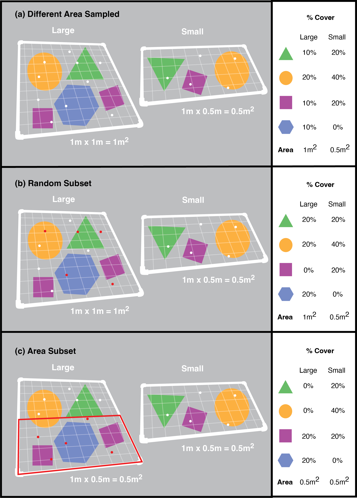

# Summary

Biodiversity is a crucial component of ecosystems, such that the monitoring of biodiversity is a priority for effective conservation programs. For communities of sessile organisms, it is common to implement quadrats (a frame isolating a known area) to quantify the ecosystem’s biodiversity. Technological advancements like photo quadrats and machine learning provide potential for the collection of quadrat data from different monitoring programs and for studies to conduct larger scale analyses. However, for quadrat data from different methodologies to be compatible, data must be standardized to the same area. The [quadcleanR](https://dominiquemaucieri.com/quadcleanR/) R package was created to assist in standardizing quadrat areas while maintaining the spatial relationships between identified organisms and substrates as well as assist in the cleanup and visualization of quadrat data. This package aims to facilitate comparability between quadrat data from different sources and streamline data cleanup.

# Statement of need

Human actions are driving losses in global biodiversity [@LewisMaslin] making the study of drivers of biodiversity a conservation priority [@isbell2017]. For communities of sessile or slow-moving organisms, quadrats allow for standardization of size and shape from which changes in community composition and structure can be recorded and monitored spatially and temporally [@clements1916plant]. Photos of quadrats increase the speed that data can be collected _in situ_, as the processing time can occur later by trained researchers, instead of at the time of collection [@Preskitt:2004]. Nowadays, photo quadrats are processed using a series of computer-generated points (either a uniform grid or random placement) being superimposed onto the image and the resulting organism or substrate that falls under these points are identified [@Preskitt:2004]. Technological advances in machine learning have supported the inclusion of deep learning in quadrat analyses [@Beijbom:2015] facilitating automated identification of organisms and substrates and increasing the speed that quadrats can be annotated with a lower associated cost [@Beijbom:2015]. However, these technological advances introduce challenges associated with quadrats collected under different methodologies. 

For collaborative quadrat analyses, it is crucial that quadrat data are being properly compared to account for different methodologies. Size of quadrats varies based on the research question, study site and target species [@Benedetti:1996]; however, biomass and diversity estimates are greatly influenced by the size of quadrats [@Shmida; @williams1964; @anderson1993effect]. Thus, issues can arise when studies examine many different quadrats from various locations, which have been sampled using different quadrat sizes. If quadrat samples are being cropped to the same size before species are identified, this will produce comparable sized quadrats to be used in analysis; however, if experts have identified the species in their quadrats prior to sharing data, researchers must ensure that methods taken to standardize the size of quadrats properly considers the spatial nature of quadrat data. Currently there are no standardized methods to account for the size of quadrats and as global studies become more accessible, there is a need for standardizing these methodologies. The [quadcleanR](https://dominiquemaucieri.com/quadcleanR/) R package provides tools to assist in standardizing quadrat areas and the cleanup of quadrat data. These functions provide a streamlined process for taking quadrat data, accounting the size of quadrats, and cleaning the data sets. Additionally, this package incorporates a Shiny app [@shiny] that uses the user's own data to produce an interactive interface where researchers can examine variables and trends in their data.

# Cropping by area

When employing random point photo quadrats to assist with quantifying biodiversity, the organisms that are being quantified will take up space, and by chance, multiple points can land on the same individual or colony. Species interactions and competition between species will influence what species can be found around others [@cooccurrence] and averaging the percent or proportion cover of different sized quadrats will increase sources of error and variation [@anderson1993effect]. To illustrate how the crop_area() function tackles this issue, consider two quadrats of differing sizes, which have already had random points identified on them (Figure 1a). These quadrats have the same density of random points (1pt/0.1 m$^2$) with a differing number of random points in each quadrat (large = 10pts, small = 5pts). 

To standardize the number of points in each quadrat, one would simply randomly subset the random points (Figure 1b). However, this still leaves the large quadrat surveying a larger area, having a different ability to detect diversity or biomass compared to the small quadrat and introducing sources of error or variation [@anderson1993effect] and therefore the quadrats are not comparable. 

The `crop_area()` function will crop the area of the photo and extract the random points that occur within that area (Figure 1c). If the quadrats contain the same density of random points, this will give roughly the same number of random points while maintaining the same area and making the quadrats comparable. If the density of points is not the same, once the areas have been cropped to the same size, the random points can be further subsetted so that there is the same number of random points in the same sized area. This function and package will allow researchers to be able to quickly standardize quadrats from many different sources to perform larger scale analyses while maintaining the original identified random points. 

# Acknowledgements

This package includes data that was collected by the Kiritimati Field Teams associated with Dr. Julia K. Baum (University of Victoria). I thank everyone who helped with the data collection and processing for the data contained within this package. D.G.M. was supported by the University of Victoria during the duration of this project. Finally, I would like to thank M.A. Davies and J.M. Alfaro-Lucas for initial feedback on this manuscript as well as Vinícius B. Rodrigues and Renata Diaz for their reviews. 

# References

